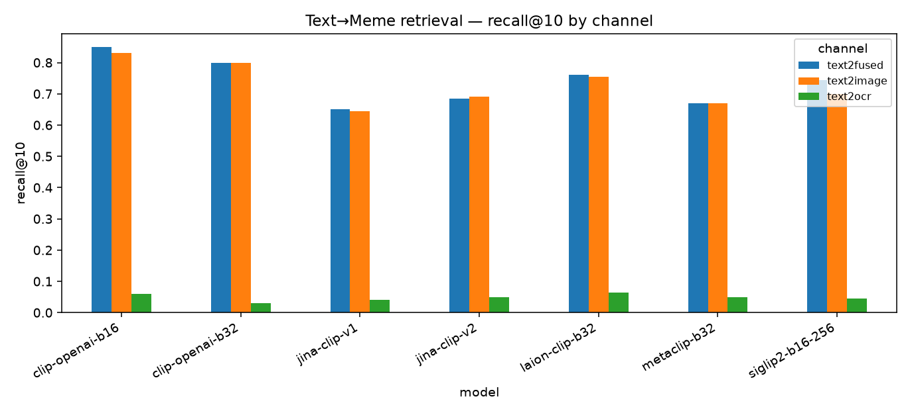
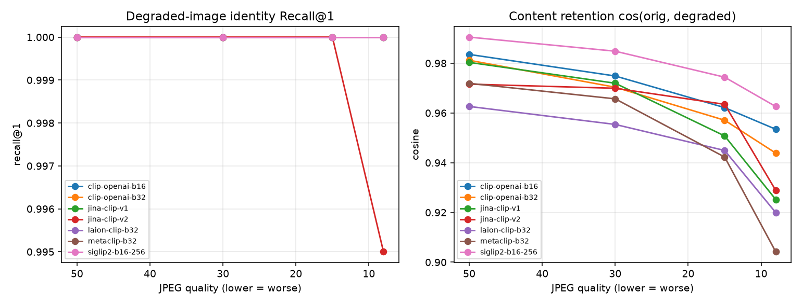

# Benchmark summary

- Models: clip-openai-b16, clip-openai-b32, jina-clip-v1, jina-clip-v2, laion-clip-b32, metaclip-b32, siglip2-b16-256
- Tests: jpeg_robustness, space_consistency, text2fused, text2image, text2ocr

## Retrieval (Text→Meme)

| model           |   text2fused·mrr |   text2image·mrr |   text2ocr·mrr |   text2fused·ndcg@10 |   text2image·ndcg@10 |   text2ocr·ndcg@10 |   text2fused·recall@1 |   text2image·recall@1 |   text2ocr·recall@1 |   text2fused·recall@10 |   text2image·recall@10 |   text2ocr·recall@10 |   text2fused·recall@5 |   text2image·recall@5 |   text2ocr·recall@5 |
|:----------------|-----------------:|-----------------:|---------------:|---------------------:|---------------------:|-------------------:|----------------------:|----------------------:|--------------------:|-----------------------:|-----------------------:|---------------------:|----------------------:|----------------------:|--------------------:|
| clip-openai-b16 |           0.7019 |           0.7099 |         0.0403 |               0.7328 |               0.7338 |             0.0342 |                 0.625 |                  0.64 |               0.015 |                  0.85  |                  0.83  |                0.06  |                 0.795 |                 0.79  |               0.04  |
| clip-openai-b32 |           0.5876 |           0.6159 |         0.0227 |               0.6353 |               0.6564 |             0.0122 |                 0.47  |                  0.51 |               0     |                  0.8   |                  0.8   |                0.03  |                 0.745 |                 0.755 |               0.015 |
| jina-clip-v1    |           0.5084 |           0.5151 |         0.0229 |               0.5343 |               0.5378 |             0.0143 |                 0.435 |                  0.45 |               0     |                  0.65  |                  0.645 |                0.04  |                 0.595 |                 0.59  |               0.015 |
| jina-clip-v2    |           0.5361 |           0.5436 |         0.0348 |               0.5652 |               0.5722 |             0.0266 |                 0.455 |                  0.46 |               0.01  |                  0.685 |                  0.69  |                0.05  |                 0.62  |                 0.625 |               0.035 |
| laion-clip-b32  |           0.6266 |           0.6282 |         0.0388 |               0.6546 |               0.6543 |             0.0339 |                 0.555 |                  0.56 |               0.01  |                  0.76  |                  0.755 |                0.065 |                 0.7   |                 0.71  |               0.04  |
| metaclip-b32    |           0.5108 |           0.5014 |         0.0291 |               0.5426 |               0.5347 |             0.0224 |                 0.43  |                  0.42 |               0.005 |                  0.67  |                  0.67  |                0.05  |                 0.62  |                 0.585 |               0.025 |
| siglip2-b16-256 |           0.5349 |           0.4944 |         0.0355 |               0.5794 |               0.536  |             0.0265 |                 0.44  |                  0.4  |               0.015 |                  0.745 |                  0.7   |                0.045 |                 0.65  |                 0.595 |               0.03  |

## Bad-quality / JPEG robustness

